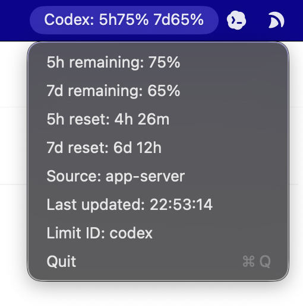

<p align="center">
  <a href="#中文">简体中文</a> |
  <a href="#english">English</a> |
  <a href="LICENSE">MIT License</a>
</p>

# CodexTopGuage_Mac

## 中文

CodexTopGuage_Mac 是一个 macOS menu bar 小工具，用来在顶部状态栏显示本机 Codex 剩余额度信息，例如当前单一周限额下的 `Codex: 7d92%`。

> 注意：本项目使用 Codex app-server 的内部/实验性 `account/rateLimits/read` 通道。它不是公开稳定 API，Codex 更新后可能需要调整解析逻辑。



上图是软件运行截图：顶部状态栏显示 Codex 剩余额度，点击后显示 reset 时间、数据来源和 limit 信息。

### 功能

- 根据接口返回的限额窗口动态显示 remaining 百分比，例如 `7d92%`；若官方恢复多个窗口，会自动并列显示。
- 点击菜单查看 reset 倒计时、数据来源、limit 信息和最后更新时间。
- 每 5 秒自动刷新，菜单不暴露刷新设置。
- 完全本地运行，不上传 usage、prompt、项目路径或账号数据。
- Codex 未安装、未登录、接口超时或返回空数据时不会崩溃，会在菜单里显示错误状态。

### 系统要求

- macOS 13 或更新版本。
- Xcode Command Line Tools 或 Xcode。
- 已安装 ChatGPT（其中包含 ChatGPT Codex），默认路径为 `/Applications/ChatGPT.app`。
- ChatGPT Codex 已登录可用。

本工具会优先使用新版路径 `/Applications/ChatGPT.app/Contents/Resources/codex`，并兼容旧版 `/Applications/Codex.app/Contents/Resources/codex`。

### 快速开始

```bash
git clone https://github.com/Kenneth2Y/CodexTopGuage_Mac.git
cd CodexTopGuage_Mac
swift build -c release
.build/release/CodexTopGuageMac
```

运行后，Dock 不会出现图标；请查看 macOS 顶部 menu bar。

### 手动重新打开

如果你在菜单里点了 `Quit` 手动退出，可以用任一方式重新打开：

```bash
.build/release/CodexTopGuageMac
```

也可以在 Finder 里双击项目根目录的 `Start CodexTopGuage.command`。首次双击时，macOS 可能会提示安全确认；确认后它会自动构建 release 版本并启动菜单栏程序，然后自动关闭临时 Terminal 窗口。

如果已经启用开机自启动，也可以重新登录 macOS，LaunchAgent 会自动拉起它。

脚本会对本地构建产物做 ad-hoc code signing，避免重新编译后被 macOS 拦截启动。

### 开机自启动

启用当前用户登录后自动启动：

```bash
chmod +x scripts/install-launch-agent.sh scripts/uninstall-launch-agent.sh
scripts/install-launch-agent.sh
```

关闭开机自启动：

```bash
scripts/uninstall-launch-agent.sh
```

当前 LaunchAgent 使用 `.build/release/CodexTopGuageMac` 的绝对路径。如果移动项目目录，请重新运行安装脚本。

### menu bar 空间限制

macOS 顶部 menu bar 的空间分配由系统控制。右侧状态栏图标很多时，系统可能隐藏、截断或挤掉部分菜单栏项目；应用本身不能完全控制这个行为。CodexTopGuage_Mac 会使用简短的动态窗口标签，例如 `Codex: 7d92%`，但在窄屏或图标很多的情况下仍可能被系统遮挡。

### 本地开发

```bash
swift build
swift run CodexTopGuageMac
```

如果顶部栏显示 `Codex: --` 或菜单显示错误，请先确认 ChatGPT Codex 可执行文件存在：

```bash
ls -l /Applications/ChatGPT.app/Contents/Resources/codex
```

### 数据来源

首版只实现主通道：

```text
/Applications/ChatGPT.app/Contents/Resources/codex app-server --listen stdio://
  -> initialize
  -> account/rateLimits/read
```

规划文档中的 SQLite / rollout log fallback 暂未实现，后续可作为独立 provider 加入。

### 打包建议

当前是 Swift Package 形式，适合源码安装和开发。后续可以增加 Xcode project、签名、notarization 和 `.dmg` 分发流程。

### 隐私

本工具只读取本机 Codex app-server 返回的 usage/rate limit 信息，不读取 prompt 内容，不扫描项目文件，不连接第三方服务器。

### 许可证

MIT。见 [LICENSE](LICENSE)。

## English

CodexTopGuage_Mac is a small macOS menu bar utility that shows local Codex remaining quota in the status bar, for example `Codex: 7d92%` with the current single weekly limit.

> Note: this project uses the internal/experimental Codex app-server method `account/rateLimits/read`. It is not a stable public API, so future Codex updates may require parser changes.


The image above is a runtime screenshot: the menu bar shows remaining Codex quota, and the menu shows reset times, data source, and limit metadata.

### Features

- Dynamically shows remaining percentages for the windows returned by the API, such as `7d92%`; multiple windows are displayed together if they return in the future.
- Menu details include reset countdowns, data source, limit metadata, and last update time.
- Refreshes automatically every 5 seconds without exposing refresh controls in the menu.
- Runs fully locally. It does not upload usage, prompts, project paths, or account data.
- Handles missing Codex installation, login issues, timeouts, and unavailable usage without crashing.

### Requirements

- macOS 13 or later.
- Xcode Command Line Tools or Xcode.
- ChatGPT with ChatGPT Codex installed at the default `/Applications/ChatGPT.app` path.
- A usable signed-in ChatGPT Codex session.

The app prefers the current `/Applications/ChatGPT.app/Contents/Resources/codex` executable and remains compatible with the legacy `/Applications/Codex.app/Contents/Resources/codex` location.

### Quick Start

```bash
git clone https://github.com/Kenneth2Y/CodexTopGuage_Mac.git
cd CodexTopGuage_Mac
swift build -c release
.build/release/CodexTopGuageMac
```

After launch, the app has no Dock icon. Check the macOS menu bar.

### Reopen Manually

If you manually quit the app from the menu, reopen it with either method:

```bash
.build/release/CodexTopGuageMac
```

You can also double-click `Start CodexTopGuage.command` in the project root from Finder. On first launch, macOS may show a security confirmation; after confirmation, the script builds the release binary if needed, starts the menu bar app, and closes the temporary Terminal window automatically.

If Start at Login is enabled, logging out and back into macOS will also start it again through LaunchAgent.

The script applies local ad-hoc code signing to the built binary so macOS does not block it after rebuilds.

### Start at Login

Enable auto-start for the current macOS user:

```bash
chmod +x scripts/install-launch-agent.sh scripts/uninstall-launch-agent.sh
scripts/install-launch-agent.sh
```

Disable auto-start:

```bash
scripts/uninstall-launch-agent.sh
```

The LaunchAgent uses the absolute path to `.build/release/CodexTopGuageMac`. If you move the project directory, run the install script again.

### Menu Bar Space Limits

macOS controls menu bar item placement. When the right side of the menu bar is crowded, the system may hide, truncate, or push out some items; the app cannot fully control that behavior. CodexTopGuage_Mac uses short dynamic window labels, for example `Codex: 7d92%`, but it can still be hidden on narrow screens or heavily populated menu bars.

### Local Development

```bash
swift build
swift run CodexTopGuageMac
```

If the menu bar shows `Codex: --` or the menu reports an error, first verify the ChatGPT Codex executable:

```bash
ls -l /Applications/ChatGPT.app/Contents/Resources/codex
```

### Data Source

The first version implements the main channel only:

```text
/Applications/ChatGPT.app/Contents/Resources/codex app-server --listen stdio://
  -> initialize
  -> account/rateLimits/read
```

The SQLite / rollout log fallback described in the planning brief is not implemented yet. It can be added later as a separate provider.

### Packaging

This repository is currently a Swift Package, suitable for source installation and development. An Xcode project, signing, notarization, and `.dmg` packaging can be added later.

### Privacy

This tool only reads usage/rate limit information returned by the local Codex app-server. It does not read prompt content, scan project files, or connect to third-party servers.

### License

MIT. See [LICENSE](LICENSE).
